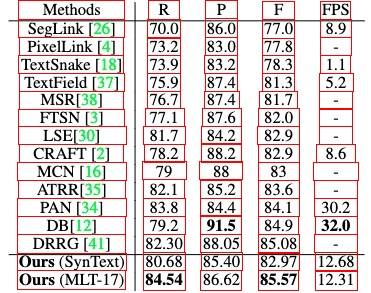

## LGPMA_Infer
- 整理自于: [DAVAR-Lab-OCR](https://github.com/hikopensource/DAVAR-Lab-OCR/tree/main/demo/table_recognition/lgpma)
- 因为该模型都是基于英文表格训练而来，因此对于中文表格识别能力较差，但是也具有一定的适应能力。

#### 模型下载
- [pth (Access Code: zUoX)](https://one.hikvision.com/#/link/u9YgYyoPW3hLw6iolFoA) 177M 
- 下载之后放到`models`目录下即可

#### 环境搭建
- `mmdet`: 该库不用安装，因为仓库中已经有了mmdet离线包，该包是下载的2.25.0，为了可以转onnx，里面做了一些修改，不影响现在的推理
- 其他库安装：
  ```shell
  pip install -r requirements.txt -i https://pypi.douban.com/simple/
  ```

#### demo运行
```shell
python test_pub.py

# 输出结果，会在output目录下保存绘制框线的图像
# OK
```
- 结果示例：
  - 原图：

    

  - 识别结果:

     

#### 模型转onnx
- 状态：可以成功转换,转换时也特别耗费内存-_-!，同时因基于ONNXRuntime推理时，太耗费内存，而放弃
- 转换脚本:
  ```shell
  bash model_2_onnx.sh
  ```
- 转换之后onnx模型下载[link](https://drive.google.com/file/d/1t2muqUFif-jbbTqQUrWGHjHZo3MgYxgQ/view?usp=sharing)，仅供参考，推理尚未成功
- 验证推理代码：
  ```python
  # 在davarocr/davar_common/apis/inference.py#L119行插入
  import onnxruntime
  session = onnxruntime.InferenceSession('lgpma.onnx')
  input_name = session.get_inputs()[0].name
  inputs = {
      input_name: data['img'][0].numpy().astype(np.float32)
  }
  outs = session.run(None, inputs)
  ```

#### 参考链接
- [mmdet/pytorch2onnx](https://github.com/open-mmlab/mmdetection/blob/master/docs/en/tutorials/pytorch2onnx.md)
- [ONNX and grid_sample layer](https://github.com/pytorch/pytorch/issues/27212)
- [Pytorch转ONNX遇到的问题及解决方案](https://blog.csdn.net/JoeyChen1219/article/details/121141318)
